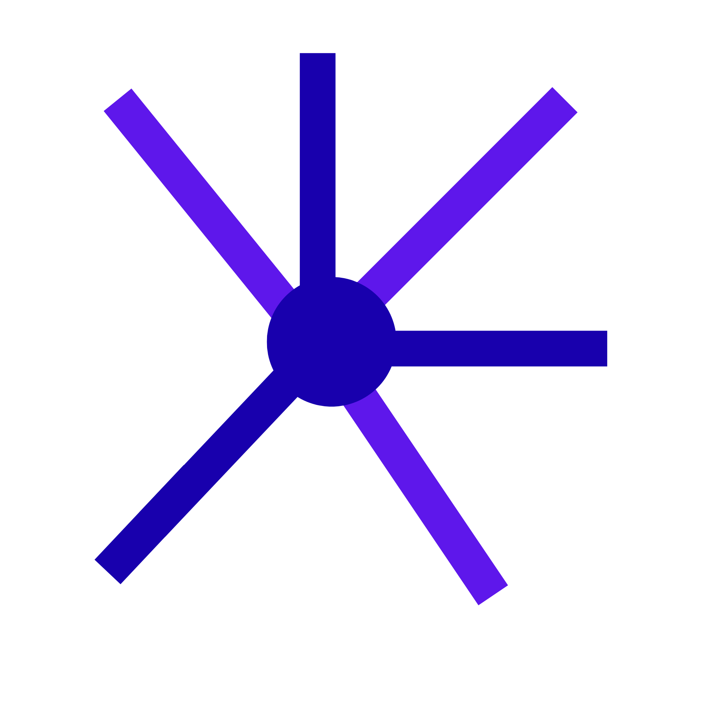

 

   
   <h1>Anant-Launcher 🚀</h1>
   
<b> Minimalist Android Launcher for Class 7 Math Masters </b>

   ---
A minimalist launcher designed for students who are distracted this is a distraction free launcher Designed for Android by Kotlin that focuses on productivity

## 🎯 Project Goals 
* **Productivity First: **A launcher that has no distracting icons just what you need 

* ** Maths Centric **
Designed by a student for students (class 7 and IOQM aspirant)

* ** Open source **
Learning and building in public.

### 🛠️Tech Stack
*Language ** KOTLIN **
*Platform ** Android**
